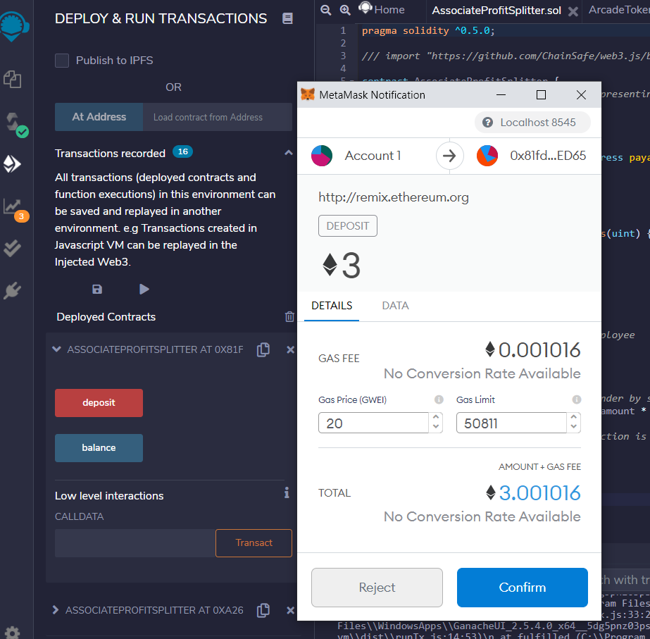

# Level One: The AssociateProfitSplitter Contract

## Level One is an AssociateProfitSplitter contract. This will accept Ether into the contract and divide the Ether evenly among the associate level employees. This will allow the Human Resources department to pay employees quickly and efficiently. Below are my step-by-step instructions with screenshots to show how the contract was deployed and the completed transactions.

_______

### AssociateProfitSplitter.sol

### Compiling the contract

### Using Ganache, I used an individual address for each employee. 

### Using injectedWeb3 and my base account, I was able to input each address into the employee fields, for payment to be sent using the contract.

### The last step is to Transact the contract and let the code send the payments to the employees. 

### As you can see in the capture below; each address that was assigned to the employees has a new value from the deployed contract payment. 

